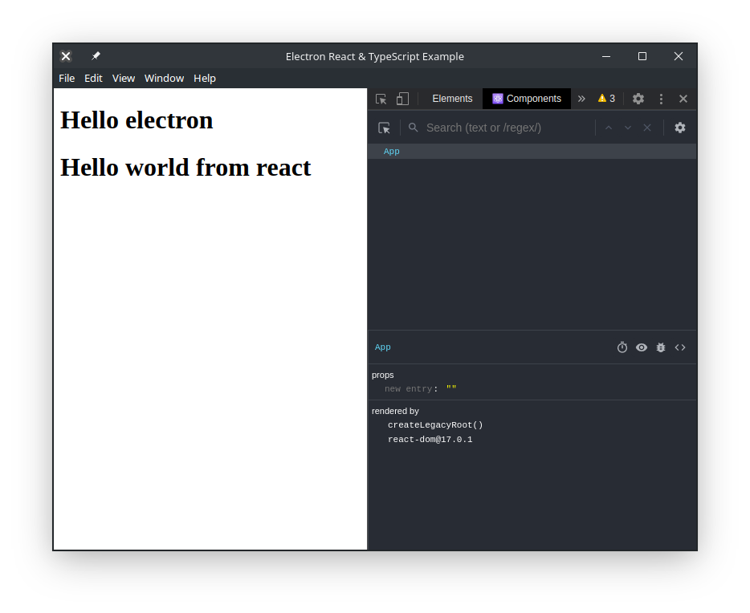

# Electron/ReactJS/Typescript Boilerplate

### Why such a project?

Did you ever found yourself trying to start a new [ReactJS](https://reactjs.org/) project working with [Electron](https://www.electronjs.org/) and using [Typescript](https://www.typescriptlang.org/) instead of JavaScript? Setting up the whole project can be a real bummer. With [create-react-app](https://github.com/facebook/create-react-app) the process is a lot easier but I found several libraries to be not compatible with that process.

Here comes my custom boilerplate. A minimalist setup with just what you need in order to start a new project. With React devtools and hot-reload enabled by default so you don't have to set them up. Everything is bundled thanks to the amazing [Parcel](https://parceljs.org/) bundler.

### Installation

> Be sure to have [yarn](https://yarnpkg.com/) (or [npm](https://www.npmjs.com/)) and [git](https://git-scm.com/) installed in order to follow the next steps

First you need to clone the repo to the new project's folder and go to that folder :

```bash
git clone https://github.com/NightlySide/Electron-React-Typescript-Boilerplate.git my-new-project
cd my-new-project
```

Then you might want to install all the dependencies :

```bash
yarn install # or npm install
```

And that's it you are now prepared to start a new project using Electron and React

### Usage

There are several commands to build and start the project :

```bash
yarn build # build the package
yarn dev # run the dev build (bundled with Parcel)
yarn electron # bundle with electron-bundler
```

